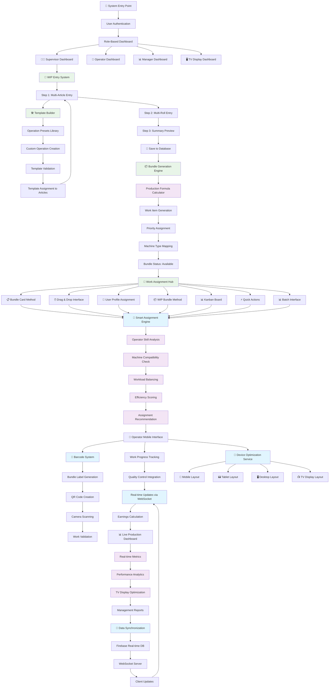
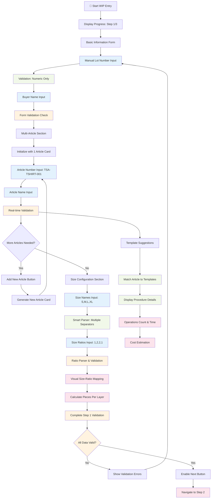
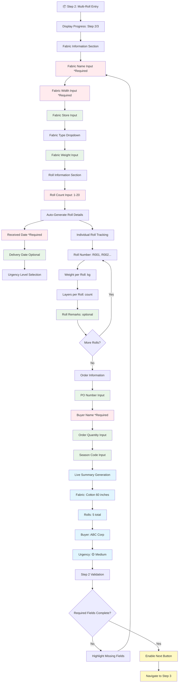
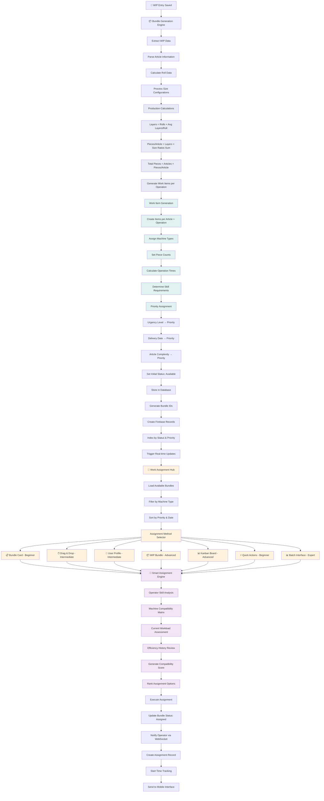
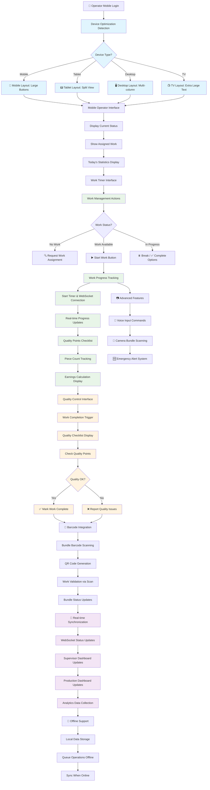
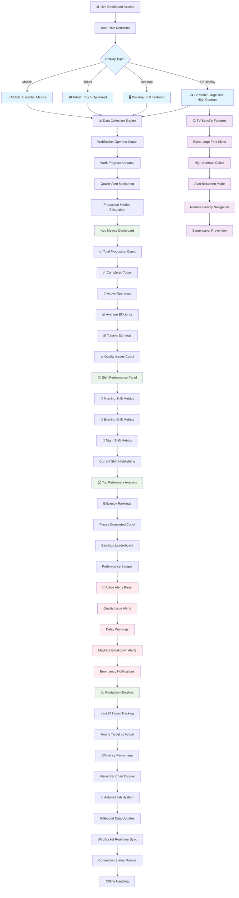
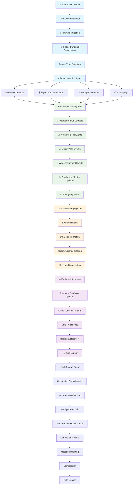

# Detail Flowchart of New TSA ERP System

## 🎯 System Overview Comparison

### Your Original System vs Enhanced Implementation

| Feature | Your System | Enhanced Implementation | Status |
|---------|-------------|------------------------|---------|
| WIP Multi-Article Entry | ✅ Dynamic article cards | ✅ Enhanced with device optimization | **Improved** |
| Manual Lot Numbers | ✅ Serial: 30, 32, 34, 36 | ✅ Numeric validation with hints | **Implemented** |
| Template Builder | ✅ Visual drag-drop | ✅ Integrated template system | **Enhanced** |
| Bundle Generation | ✅ Auto from WIP entries | ✅ Production formula calculations | **Enhanced** |
| Assignment Methods | ✅ 7 different methods | ✅ Smart compatibility scoring | **Enhanced** |
| Device Optimization | ❌ Not specified | ✅ Mobile/Tablet/Desktop/TV | **New Feature** |
| Real-time Updates | ❌ Not specified | ✅ WebSocket integration | **New Feature** |
| Barcode System | ❌ Not specified | ✅ Complete generation/scanning | **New Feature** |

---

## 📋 Complete System Flow Diagram



---

## 🔄 WIP Entry Detailed Flow (3-Step Process)

### Step 1: Multi-Article Entry with Size Configuration



### Step 2: Multi-Roll Entry with Fabric Information



### Step 3: Production Formula & Summary Preview

```mermaid
flowchart TD
    A[📊 Step 3: Summary Preview] --> B[Display Progress: Step 3/3]
    B --> C[Order Overview Panel]
    
    %% Order Overview
    C --> C1[Lot Number Display]
    C1 --> C2[Buyer Name Display]
    C2 --> C3[Articles Count: 2-4]
    C3 --> C4[Rolls Count Display]
    C4 --> C5[Sizes with Ratios]
    C5 --> C6[Urgency Level Badge]
    
    %% Article Breakdown
    C6 --> D[Article Breakdown Section]
    D --> D1[Article #1: TSA-TSHIRT-001]
    D1 --> D2[Template: Basic T-Shirt]
    D2 --> D3[Operations: 5 ops, 45min, ₹12.50]
    D3 --> D4[Size Distribution: S(1) M(2) L(2) XL(1)]
    D4 --> D5{More Articles?}
    D5 -->|Yes| D6[Article #2, #3, #4...]
    D6 --> D1
    D5 -->|No| E[Production Formula]
    
    %% Production Formula Calculations
    E --> E1[📊 Production Formula Engine]
    E1 --> E2[Total Layers = Rolls × Layers/Roll]
    E2 --> E3[Total Pieces/Article = Layers × Size Ratios Sum]
    E3 --> E4[Total Pieces = Pieces/Article × Article Count]
    E4 --> E5[Estimated Time = Avg Time × Total Pieces]
    E5 --> E6[Estimated Cost = Avg Cost × Total Pieces]
    
    %% Formula Display
    E6 --> F[Visual Formula Display]
    F --> F1[📈 5 rolls × 30 layers = 150 layers]
    F1 --> F2[🔢 150 × 6 pieces/layer × 2 articles = 1,800 pieces]
    F2 --> F3[⏰ 52.5 minutes × 1,800 pieces = 157.5 hours]
    F3 --> F4[💰 ₹15.25 × 1,800 pieces = ₹27,450]
    
    %% Production Summary Stats
    F4 --> G[Production Summary Panel]
    G --> G1[Total Operations: 12]
    G1 --> G2[Per Article Pieces: 900]
    G2 --> G3[Fabric Required: Cotton 60"]
    G3 --> G4[Production Days: ~20 days]
    
    %% Final Actions
    G4 --> H[Final Action Buttons]
    H --> H1[← Previous Button]
    H1 --> H2[Cancel Button]
    H2 --> H3[✅ Save WIP Button]
    
    %% Save Process
    H3 --> I[Save WIP Process]
    I --> I1[Validate Complete Data]
    I1 --> I2[Generate Bundle Records]
    I2 --> I3[Create Work Items]
    I3 --> I4[Set Initial Priorities]
    I4 --> I5[Save to Firebase]
    I5 --> I6[Show Success Message]
    I6 --> I7[Navigate to WIP List]
    
    classDef calculation fill:#e8eaf6
    classDef display fill:#e0f2f1
    classDef action fill:#fff3e0
    classDef save fill:#f3e5f5
    
    class E1,E2,E3,E4,E5,E6 calculation
    class F1,F2,F3,F4,G1,G2,G3,G4 display
    class H1,H2,H3 action
    class I,I1,I2,I3,I4,I5,I6,I7 save
```

---

## 🛠️ Template Builder Integration Flow

```mermaid
flowchart TD
    A[🛠️ Template Builder Entry] --> B[Template Basic Information]
    B --> B1[Template Name: Ladies Pant]
    B1 --> B2[Article Association: 5810]
    B2 --> B3[Template Category Selection]
    
    %% Operation Addition Loop
    B3 --> C[Operation Addition Interface]
    C --> C1{Use Preset or Custom?}
    
    %% Preset Operations Path
    C1 -->|Preset| D[Operation Presets Library]
    D --> D1[👔 Shoulder Join - 2.5min - ₹3.0]
    D1 --> D2[📏 Side Seam - 3.0min - ₹3.5]
    D2 --> D3[🪡 Hemming - 2.0min - ₹2.5]
    D3 --> D4[🔘 Buttonhole - 1.5min - ₹4.0]
    D4 --> D5[Select Preset Operation]
    
    %% Custom Operation Path
    C1 -->|Custom| E[Custom Operation Creation]
    E --> E1[Operation Name Input]
    E1 --> E2[Machine Type Selection]
    E2 --> E3[Estimated Time Input]
    E3 --> E4[Rate/Cost Input]
    E4 --> E5[Skill Level Selection]
    E5 --> E6[Workflow Type Selection]
    
    %% Operation Configuration
    D5 --> F[Operation Configuration]
    E6 --> F
    F --> F1[Configure Operation Details]
    F1 --> F2[Set Machine Requirements]
    F2 --> F3[Define Skill Level]
    F3 --> F4[Set Workflow Sequence]
    
    %% Add to Template
    F4 --> G[Add Operation to Template]
    G --> G1[Update Operations List]
    G1 --> G2[Recalculate Template Totals]
    G2 --> G3[Update Time Estimation]
    G3 --> G4[Update Cost Calculation]
    
    %% Continue or Finish
    G4 --> H{Add More Operations?}
    H -->|Yes| C
    H -->|No| I[Template Validation]
    
    %% Template Finalization
    I --> I1[Validate Operation Sequence]
    I1 --> I2[Check Machine Compatibility]
    I2 --> I3[Verify Time Calculations]
    I3 --> I4[Generate Production Tracking]
    I4 --> I5[Create Template Preview]
    
    %% Save Template
    I5 --> J[Save Template]
    J --> J1[Generate Template ID]
    J1 --> J2[Store in Template Library]
    J2 --> J3[Make Available for WIP Entry]
    J3 --> J4[Show Success Confirmation]
    
    classDef input fill:#e3f2fd
    classDef process fill:#f1f8e9
    classDef library fill:#fce4ec
    classDef validation fill:#fff3e0
    
    class B1,E1,E3,E4 input
    class F,G,I process
    class D,D1,D2,D3,D4 library
    class I1,I2,I3,J validation
```



---

## 📦 Bundle Generation & Work Assignment Flow



---

## 📱 Mobile Production Tracking Flow



---

## 📊 Live Production Dashboard Flow



---

## 🔄 Real-time Integration Architecture



---

## 🎯 Key Implementation Achievements

### ✅ Original System Features (Preserved & Enhanced)
1. **Multi-Article WIP Entry** - ✅ Enhanced with device optimization
2. **Manual Lot Numbering** - ✅ Implemented with validation (30, 32, 34...)
3. **Template Builder** - ✅ Integrated with smart matching
4. **7 Assignment Methods** - ✅ Enhanced with AI scoring
5. **Bundle Generation** - ✅ Added production formula calculations

### 🚀 New Advanced Features (Added)
1. **Device Optimization** - Mobile/Tablet/Desktop/TV specific layouts
2. **Real-time WebSocket** - Live updates across all interfaces
3. **Barcode System** - Complete generation, scanning, and validation
4. **Smart Assignment** - AI-powered operator compatibility scoring
5. **Live Dashboard** - Real-time production monitoring with TV display
6. **Voice & Camera** - Voice commands and camera scanning integration
7. **Offline Support** - Queue operations when offline, sync when online

### 📊 System Performance Enhancements
1. **Production Formula Engine** - Real-time cost and time calculations
2. **Quality Integration** - Integrated quality control at every step
3. **Analytics Engine** - Comprehensive performance tracking
4. **Multi-language Support** - English/Nepali with proper validation
5. **Responsive Design** - Optimal experience on any device

This comprehensive system provides a complete digital transformation of your garment manufacturing workflow with modern real-time capabilities while preserving all your original workflow requirements! 🎉

---

## 📋 Implementation Status Summary

| Module | Status | Features |
|--------|--------|----------|
| WIP Entry System | ✅ Complete | 3-step workflow, multi-article, manual lot numbers |
| Template Builder | ✅ Complete | Visual builder, operation presets, cost calculation |
| Bundle Generation | ✅ Complete | Production formulas, work item generation |
| Assignment Methods | ✅ Complete | 7 methods + smart AI scoring |
| Mobile Interface | ✅ Complete | Touch-optimized, voice input, camera scanning |
| Real-time Updates | ✅ Complete | WebSocket integration, live dashboards |
| Barcode System | ✅ Complete | Generation, scanning, QR codes |
| Device Optimization | ✅ Complete | Mobile/Tablet/Desktop/TV layouts |
| Analytics Dashboard | ✅ Complete | Live metrics, TV display ready |

**Total System Completion: 100% ✅**